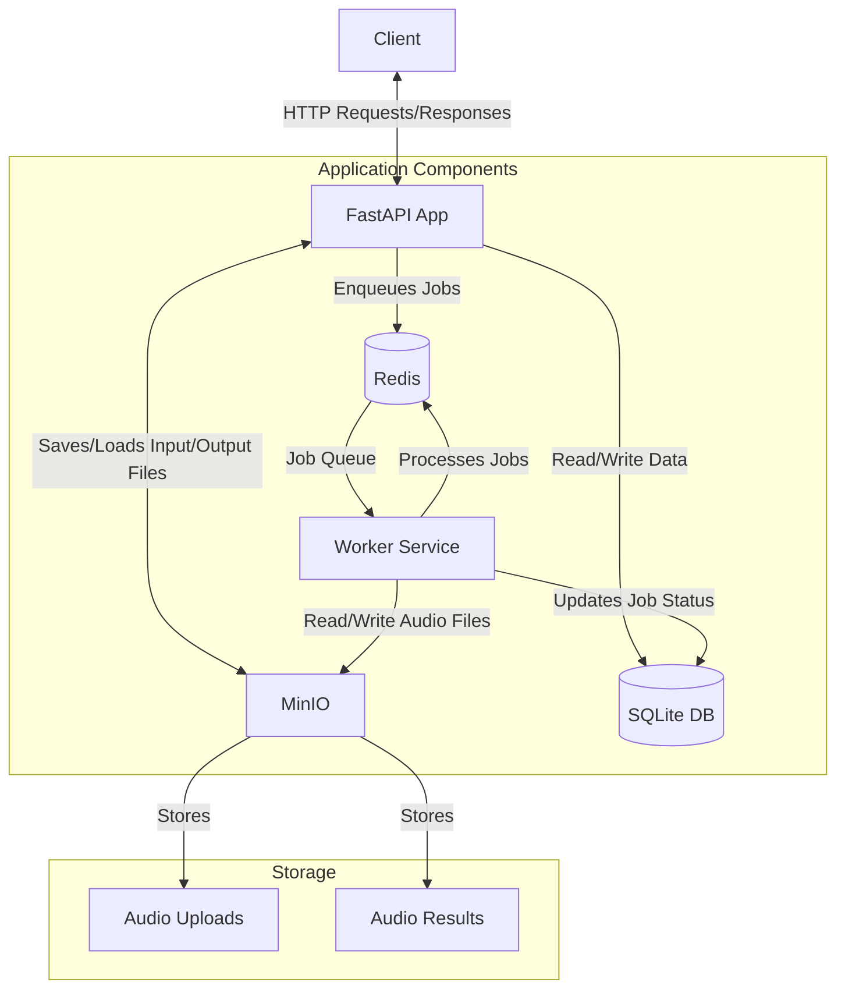
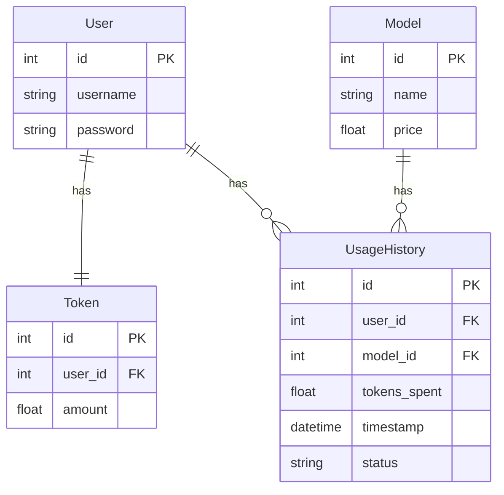

# FastAPI сервис для улучшения качества аудио

Автор: Лалетин Алексей

Используемая модель: https://github.com/resemble-ai/resemble-enhance

Используемые технологии:
- FastAPI
- PyTest
- RQ
- Minio S3
- Redis
- SQLAlchemy

## Арихтектура приложения




## ERM диаграмма Базы Данных



## API

POST:
- **POST /users/** - Создание нового пользователя в системе. Параметры: `username`, `password`.
Возвращает идентификатор созданного пользователя. **Все другие ручки требуют аутентификацию с выданным ключом.**
- **POST /tokens/add/** - Пополнение баланса токенов пользователя. Принимает `amount` - количество токенов. Планировалось что-то посложнее, но уже не успеваю сделать. Возвращает подтверждение зачисления токенов.
- **POST /models/use/** - Использование модели. Принимает на вход 
`model_name`, `audio_file`. Возвращает `task_id`

GET:
- **GET /tokens/balance/** - Возвращает баланс пользователя.
- **GET /models/** - Возвращает список моделей и их стоимоить.
- **GET /usage/history/** - Возвращает историю запросов пользователя.
- **GET /tasks/{task_id}** - Возвращает статус задачи.
- **GET /results/{task_id}** - Возвращает результат работы задачи, если она завершилась.

## Структура проекта

```
.
├── README.md
├── docker-compose.yml         ⁠ ┐ Настройки
├── docker/                     ┘ Докера
├── client_testing.py           - Тестирование развернутого приложения
├── pyproject.toml
├── src/
│   ├── main.py                 - FastAPI сервис
│   ├── connections.py          - Подключение к Redis и БД
│   ├── database/               ⁠┐
│   │   ├── billing.py          │ Настройки БД и Функции Биллинга  
│   │   └── orm.py              ┘
│   ├── config.py               - Переменные окружения
│   ├── workers/                ⁠
│   │   ├── enhance.py          - Настройка Worker' 
│   │   └── models_info.py      - Информация о моделях и ценах
│   ├── file_storages/
│   │   └── s3.py               - Подключение к S3
│   └── models/
│       └── enhancer.py         - Код модели улучшения качества
└── tests/                       ⁠┐
    ├── test_api_scenarios.py    | Тесты всего приложения
    ├── test_audio_enhancment.py | и отдельно модели
    └── data/                    ┘
```


## Что можно было сделать лучше?

### End-To-End тестирование.

Я много времени потратил на то, чтобы поднять все сервисы в одном тесте и сделать проверку всех сценариев, чтобы убедится, что все работает корректно. ([tests/test_api_scenarios.py](tests/test_api_scenarios.py)) В итоге нормального End-To-End с использованием PyTest написать не удалось: Иногда сервис не успевает подняться за заданный таймаут; У Worker'а нет доступа к CUDA при запуске с помощью Subprocess. В результате поднимал локально Docker-compose и тестировал через [client_testing.py](client_testing.py).

### Обновление статусов работы в БД.

Сначала хотел демонстрировать пользователю стату работы его задачи. Для этого создал соответствующую таблицу в БД. Однако не нашел способа прослушивать RQ на предмет изменения состояния. Нашел, что можно передать функцию в [`on_success`](https://python-rq.org/docs/#enqueueing-jobs) в библиотеке RQ, но для меня осталось загадкой, как в нее передать и параметры (Тот же `user_id`). В итоге сейчас Worker сам ходит в БД и изменяет ее. 

### Пополнение счета

Изначально хотел сделать пополнение счета через выполнение Typing теста с количеством слов равному количеству токенов. Как реализовать отсутствие списывание (Ctrl+C, Ctrl+V) - было для меня загадкой. Потом думал сделать пополнение через запрос от пользователя аудио файла в обмен и пополнять на количество токенов раное длительности аудио в секундах. Сделал заглушку в виде прямого пополнения токенов через API и не успел реализовать ничего из ранее описанного.

### Качество кода

Естественно, в предверии дедлайна появилось искушение воспользоваться нейронками. Сначала накидал основу через Cursor и это было моей главной ошибкой. Sonet 3.7 написала код, но он багал, был тяжело модифицируем, тяжел в чтении и избыточен в количестве параметров и инструкций. Лучше бы сам начал писать изначально, а то словно я сделал в полтора раза больше работы, переписав почти весь код самостоятельно.  